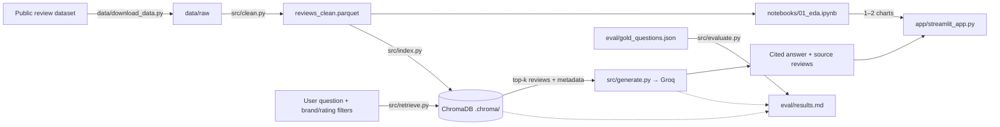
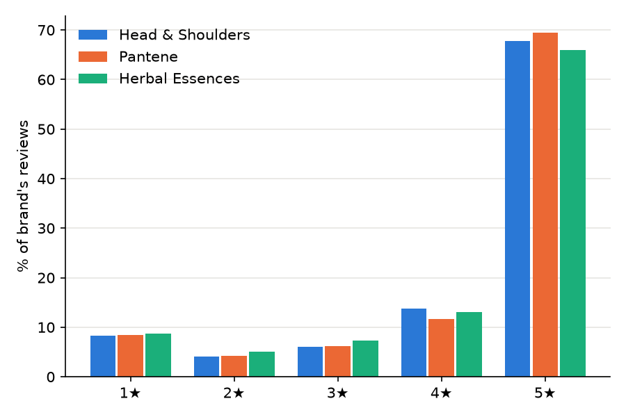
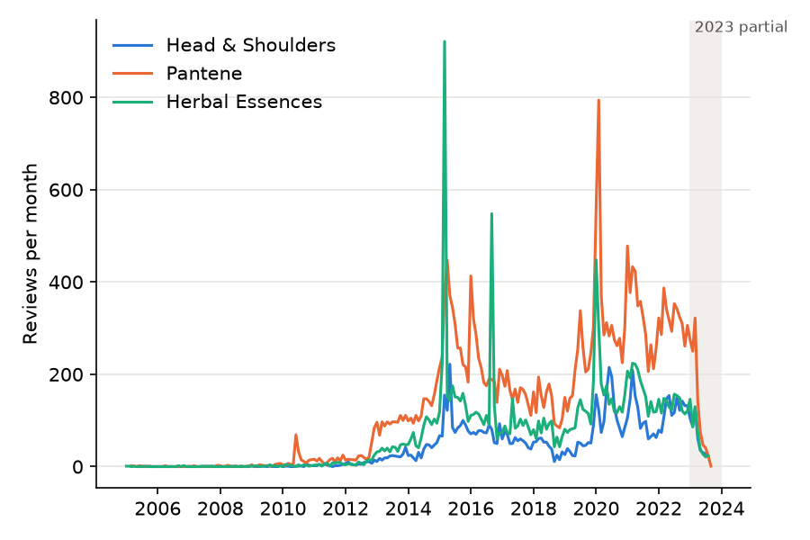

# consumer-review-rag

Exploratory analysis and a cited question-answering app over public Amazon reviews of three haircare brands (Head & Shoulders, Pantene, and Herbal Essences), drawn from the Amazon Reviews 2023 dataset (Hou et al. 2024, arXiv:2403.03952).

**Live demo:** https://consumer-review-rag.streamlit.app/ (first load after a sleep rebuilds the index and can take several minutes; see [How to run locally](#how-to-run-locally) to run it yourself).

## Why this project

Consumer-goods brand teams need to know what shoppers praise and complain about, with answers they can check. This project builds two layers on one corpus of public Amazon reviews: an EDA layer that turns ratings, volume, sentiment, and recurring themes into analyst-ready insight per brand, and a retrieval-augmented generation (RAG) layer that answers natural-language questions using only the retrieved reviews. Every answer cites its sources by brand, rating, and snippet, and the system declines when the reviews do not cover the question.

## My role

<!-- DRAFT for the maintainer to edit: keep only decisions you actually made, in your own words, then delete this comment. -->

An AI coding agent (Claude Code) wrote most of the code under my direction; the agent's configuration is in `.claude/` and `_bmad-output/`. What I decided:

- **Brands and category.** Three haircare brands (Head & Shoulders, Pantene, Herbal Essences) in one category, so brand comparisons are like-for-like. Locked 2026-09-15 in `PLAN.md`, after checking that each brand had enough reviews.
- **Complaints are filtered by star rating, not sentiment.** My EDA found that VADER scores 32.3% of 1★ reviews as positive, so the RAG app's low/high rating bands use stars.
- **What to measure.** Retrieval hit@6 and precision@6, citation validity, uncited rate, refusal accuracy, false-refusal rate, and faithfulness, with faithfulness reported for answered questions only because a refusal passes automatically.
- **Publish the failures.** The evaluation write-up and Limitations section report the misses, over-generalizations, and label noise rather than only the headline numbers.

## Architecture



## What's in it

**EDA layer.** `notebooks/01_eda.ipynb` loads the cleaned corpus and produces rating, volume, sentiment (VADER), and low- vs. high-band term charts per brand, each with a written, measured takeaway. `src/eda.py` holds every aggregation and plot helper so the notebook and the Streamlit app share the same logic and never reimplement it.

**RAG layer.** `src/index.py` chunks and embeds `review_text_normalized` locally (`sentence-transformers/all-MiniLM-L6-v2`) into a persistent ChromaDB collection. `src/retrieve.py` embeds a question, applies brand/rating-band filters inside Chroma, and returns the closest reviews with their original, unmodified text. `src/generate.py` numbers those reviews, asks Groq (`openai/gpt-oss-120b`) to answer using only them and cite every claim by number, and returns a structured refusal instead of a guess when the reviews don't cover the question. `app/streamlit_app.py` is a thin UI over both layers — it imports `retrieve()`, `answer()`, and the EDA helpers unchanged.

## Key EDA insights

- **Ratings are uniformly high and nearly identical across brands.** 65.9–69.4% of reviews are 5★ and 8.3–8.7% are 1★, so star mix barely separates Head & Shoulders, Pantene, and Herbal Essences in this sample.
- **Mean ratings were lower in 2022 than in 2015 for all three brands, by uneven amounts.** Yearly means went 4.49 → 4.06 for Head & Shoulders and 4.44 → 4.13 for Pantene, both drops larger than their monthly standard deviation (0.24, 0.15), but only 4.25 → 4.15 for Herbal Essences, within its 0.19.
- **VADER sentiment is a weak proxy for dissatisfaction.** It matches the star band for 80.9% of non-3★ reviews, yet 32.3% of 1★ and 50.4% of 2★ reviews score positive, which suggests the RAG app should filter complaints by star rating, not sentiment.
- **Packaging is the clearest complaint theme, shared by all three brands.** bottle(s) appears in 14.5–19.1% of each brand's 1–2★ reviews vs 5.0–7.0% of 4–5★; greasiness is also shared (5.2–6.1% of 1–2★), and formula is the one brand-leaning signal found (Pantene, 4.8% of 1–2★).
- **Volume is uneven and may include campaign or incentivized reviews.** It is thin before 2013 and has one-month bursts such as 921 Herbal Essences reviews in March 2015, and 3.1% of Herbal Essences 4–5★ reviews name the incentivized-review programme Influenster, a bias worth naming in the limitations below.

| Rating distribution by brand | Monthly review volume |
|---|---|
|  |  |

## Evaluation summary

Measured against an 18-question hand-written gold set (14 answerable, 4 unanswerable), full numbers and every failure in [`eval/results.md`](eval/results.md):

| Metric | Result |
|---|---|
| Retrieval hit@6 | **0.86** (12/14) |
| Retrieval precision@6 | **0.70** (mean of 14) |
| Citation validity | **1.00** (13/13) |
| Uncited rate | **0.00** (0/13) |
| Refusal accuracy (unanswerable) | **1.00** (4/4) |
| False-refusal rate (answerable) | **0.07** (1/14) |
| Faithfulness (agent-graded), answered only | **0.69** (9/13) |

The faithfulness grades are the implementing agent's judgement, not an independent grader. The two retrieval misses (both driven by the brand name in the query crowding out on-topic reviews) and every faithfulness failure are named with evidence in `eval/results.md`.

## Limitations

- The reviews are a public Amazon dataset (2005–2023), not internal company data, and coverage is uneven by brand and year — see [Key EDA insights](#key-eda-insights).
- Retrieval can miss relevant reviews or surface loosely related ones; the measured hit@6 is 0.86 and precision@6 is 0.70, not 1.00.
- The model can drift from the sources despite grounding: 4 of 13 answered gold questions failed faithfulness grading (over-generalizing a filtered sample, misreading a source, or turning a small split into a frequency claim). See `eval/results.md`.
- VADER is a lexicon heuristic, not a trained classifier: it only matches the star rating on 80.9% of non-3★ reviews, so it is directionally useful for brand-level comparison, not for finding individual complaints.
- Findings describe these 53,872 sampled reviews, not the true customer population, and some volume bursts (e.g. Herbal Essences, March 2015) may reflect incentivized-review campaigns rather than organic demand.
- The deployed app builds its search index from scratch on first load and after every redeploy or wake from sleep (the parquet is committed; the 236 MB vector index is not, to stay under GitHub's file-size limits on a zero-cost stack). The local build measured 66 s on Apple Silicon; Streamlit Community Cloud's shared CPU-only runtime will likely take several minutes.
- One agent built the system, wrote the gold questions, and graded faithfulness — nobody else checked the work. Full limitations, including gold-set and label-noise caveats, are in `eval/results.md`.

## How to run locally

```sh
# 1. Environment (Python 3.11)
uv venv
uv pip install -r requirements.txt

# 2. Secrets
cp .env.example .env
# edit .env and set GROQ_API_KEY

# 3. Data (streams and filters the source dataset; do not commit data/raw/)
uv run python data/download_data.py
uv run python -m src.clean

# 4. Build the review index (skips re-embedding on later runs)
uv run python -m src.index

# 5. Launch
uv run streamlit run app/streamlit_app.py
# or explore the analysis notebook:
uv run jupyter lab notebooks/01_eda.ipynb
```

Run the tests with `uv run python -m unittest -v`; run the scored evaluation with `uv run python -m src.evaluate` (see `eval/results.md` for the reproduce commands, including a network-free `--rescore`).

## Tech stack

| Concern | Choice |
|---|---|
| Generation | Groq `openai/gpt-oss-120b`, temperature 0.1 (free tier) |
| Embeddings | `sentence-transformers/all-MiniLM-L6-v2`, local, no second API key |
| Vector store | ChromaDB, persistent local client |
| Sentiment (EDA) | `vaderSentiment` (pretrained lexicon) |
| Data / EDA | pandas, numpy, matplotlib, seaborn, scikit-learn, Jupyter |
| App | Streamlit, deployed on Streamlit Community Cloud |
| Config | `python-dotenv`; `src/config.py` is the single source for model names, paths, and constants |
| Runtime | Python 3.11 |
