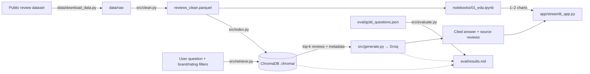

# Architecture

```mermaid
flowchart LR
  A[Public review dataset] -->|data/download_data.py| B[data/raw]
  B -->|src/clean.py| C[reviews_clean.parquet]
  C --> D[notebooks/01_eda.ipynb]
  C -->|src/index.py| E[(ChromaDB .chroma/)]
  Q[User question + brand/rating filters] -->|src/retrieve.py| E
  E -->|top-k reviews + metadata| G[src/generate.py → Groq]
  G --> H[Cited answer + source reviews]
  H --> APP[app/streamlit_app.py]
  D -->|1–2 charts| APP
  GOLD[eval/gold_questions.json] -->|src/evaluate.py| R[eval/results.md]
  E -.-> R
  G -.-> R
```
